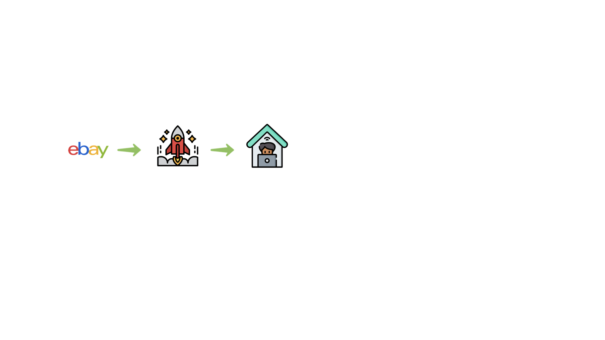
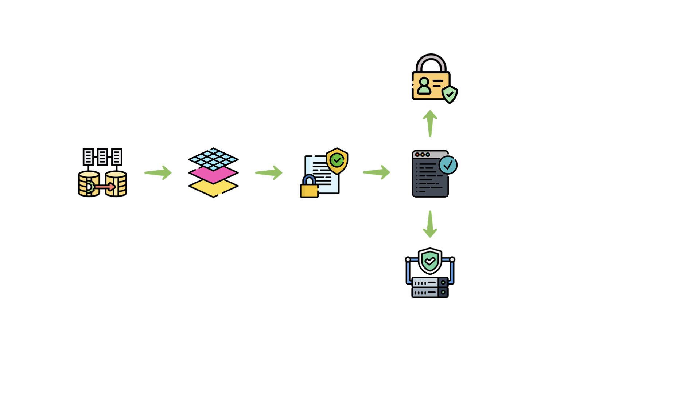

```
whoami
```


<!--s-->

```
grep -i 'situation' NewCompany
```


<!--v-->

```
grep -i 'situation' NewProject
```


<!--v-->

```
grep -i 'situation' FullyRemote
```



<!--v-->

```
grep -i 'situation' NewComers
```


<!--v-->

```
grep -i 'situation' LackInformation
```


<!--v-->

```
grep -i 'situation' ExternalDependencies
```


<!--v-->

```
grep -i 'situation' TightDeadline
```


<!--s-->

```
grep -i 'tasks' Migration
```


<!--v-->

```
grep -i 'tasks' Redesign
```


<!--v-->

```
grep -i 'tasks' StandardsCompliance
```


<!--v-->

```
grep -i 'tasks' Code
```


<!--v-->

```
grep -i 'tasks' Security
```


<!--v-->

```
grep -i 'tasks' Infrastructure
```



<!--s-->

```
grep -i 'actions' HexagonalArchitecture
```


<!--v-->

```
grep -i 'actions' SpringBoot
```


<!--v-->

```
grep -i 'actions' Maven
```


<!--v-->

```
grep -i 'actions' SpringMVC_Json
```


<!--v-->

```
grep -i 'actions' Testcontainers
```


<!--v-->

```
grep -i 'actions' Jenkins
```


<!--v-->

```
grep -i 'actions' Prometheus
```


<!--v-->

```
grep -i 'actions' Grafana
```


<!--v-->

```
grep -i 'actions' DockerCompose
```


<!--v-->

```
grep -i 'actions' ChangeToJerseyMongoDB
```


<!--s-->

```
grep -i 'results' FastLearningCurve
```


<!--v-->

```
grep -i 'results' DelayDecisions
```


<!--v-->

```
grep -i 'results' ParallelWork
```


<!--v-->

```
grep -i 'results' DeliveryOnTime
```


<!--v-->

```
grep -i 'results' ComplianceApproved
```


<!--v-->

```
grep -i 'results' SOLIDCleanCode
```


<!--v-->

```
grep -i 'results' Flexible
```


<!--v-->

```
grep -i 'results' Testing
```


<!--v-->

```
grep -i 'results' Documentation
```


<!--v-->

```
grep -i 'results' HappyEngineer
```


