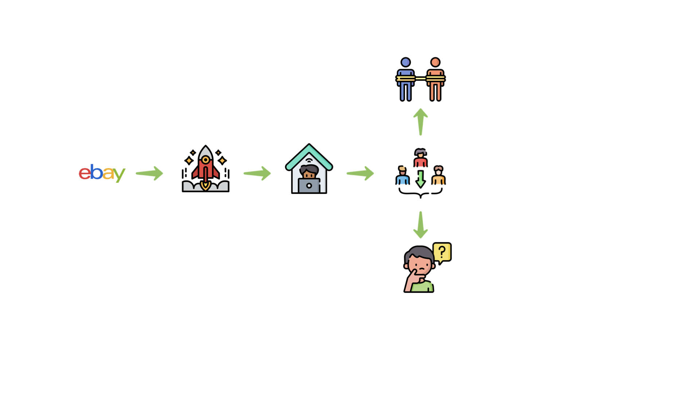
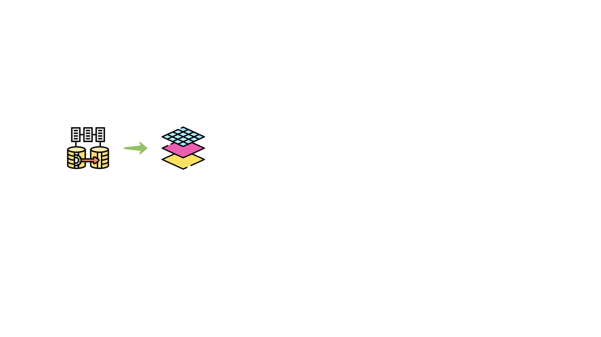
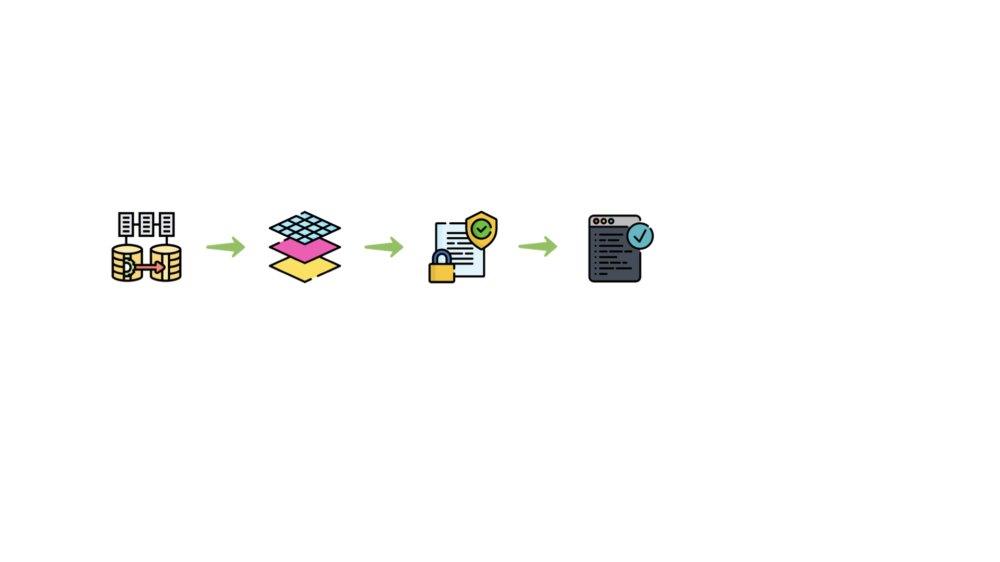
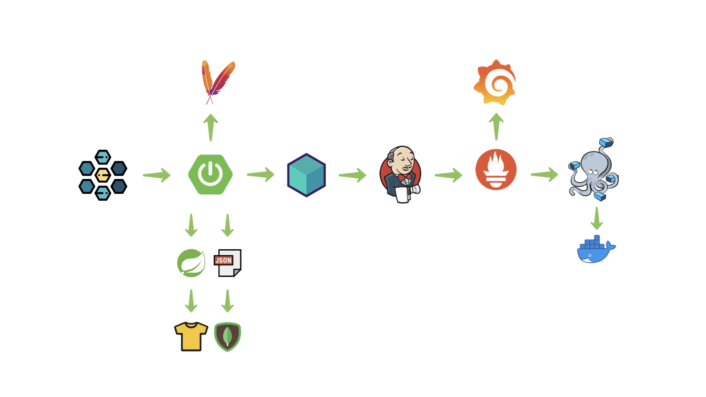
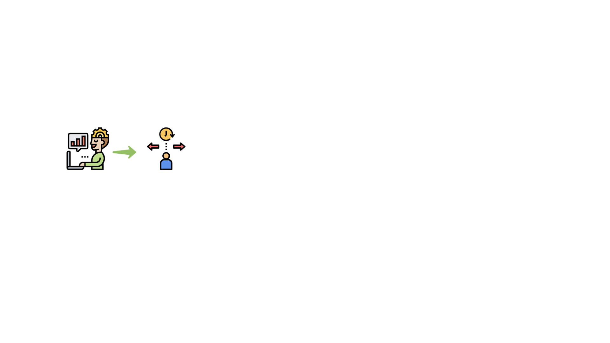
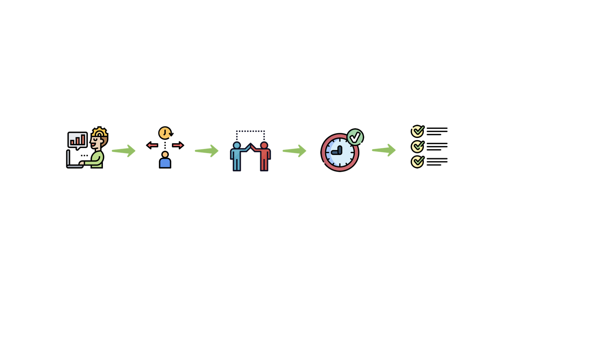

```
whoami
```


<!--s-->

```
grep -i 'situation'
```


<!--v-->

```
grep -i 'situation'
```


<!--v-->

```
grep -i 'situation'
```


<!--v-->

```
grep -i 'situation'
```


<!--v-->

```
grep -i 'situation'
```


<!--v-->

```
grep -i 'situation'
```



<!--v-->

```
grep -i 'situation'
```


<!--s-->

```
grep -i 'tasks'
```


<!--v-->

```
grep -i 'tasks'
```



<!--v-->

```
grep -i 'tasks'
```


<!--v-->

```
grep -i 'tasks'
```




<!--v-->

```
grep -i 'tasks'
```


<!--v-->

```
grep -i 'tasks'
```


<!--s-->

```
grep -i 'actions'
```


<!--v-->

```
grep -i 'actions'
```


<!--v-->

```
grep -i 'actions'
```


<!--v-->

```
grep -i 'actions'
```


<!--v-->

```
grep -i 'actions'
```


<!--v-->

```
grep -i 'actions'
```


<!--v-->

```
grep -i 'actions'
```


<!--v-->

```
grep -i 'actions'
```


<!--s-->

```
grep -i 'results'
```


<!--v-->

```
grep -i 'results'
```



<!--v-->

```
grep -i 'results'
```


<!--v-->

```
grep -i 'results'
```



<!--v-->

```
grep -i 'results'
```


<!--v-->

```
grep -i 'results'
```


<!--v-->

```
grep -i 'results'
```



<!--v-->

```
grep -i 'results'
```


<!--v-->

```
grep -i 'results'
```


